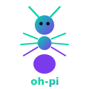

<div align="center">



# 🐜 oh-pi

**Une seule commande pour booster [pi-coding-agent](https://github.com/badlogic/pi-mono).**

Comme oh-my-zsh pour pi — mais avec une colonie de fourmis autonome.

[](https://www.npmjs.com/package/oh-pi)
[](./LICENSE)
[](https://nodejs.org)

[English](./README.md) | [中文](./README.zh.md) | [Français](./README.fr.md)

```bash
npx oh-pi
```

</div>

---

## Pourquoi

pi-coding-agent est puissant dès l'installation. Mais configurer manuellement les fournisseurs, thèmes, extensions, compétences et modèles de prompts est fastidieux. oh-pi vous offre une TUI moderne qui fait tout en moins d'une minute — et intègre un **essaim de fourmis** qui transforme pi en système multi-agents.

## Démarrage rapide

```bash
npx oh-pi    # tout configurer
pi           # commencer à coder
```

C'est tout. oh-pi détecte votre environnement, vous guide dans la configuration et génère `~/.pi/agent/` pour vous.

Vous avez déjà une config ? oh-pi la détecte et propose une **sauvegarde avant écrasement**.

## Ce que vous obtenez

```
~/.pi/agent/
├── auth.json            Clés API (permissions 0600)
├── settings.json        Modèle, thème, niveau de réflexion
├── keybindings.json     Raccourcis Vim/Emacs (optionnel)
├── AGENTS.md            Directives IA par rôle
├── extensions/          4 extensions
│   ├── safe-guard       Confirmation des commandes dangereuses + protection des chemins
│   ├── git-guard        Checkpoints auto stash + alerte dépôt modifié
│   ├── auto-session     Nommage de session depuis le premier message
│   └── ant-colony/      🐜 Essaim multi-agents autonome
├── prompts/             10 modèles (/review /fix /commit /test ...)
├── skills/              4 compétences (debug, git, setup, colony)
└── themes/              6 thèmes personnalisés
```

## Modes de configuration

| Mode | Étapes | Pour |
|------|--------|------|
| 🚀 **Rapide** | 3 | Choisir fournisseur → entrer la clé → terminé |
| 📦 **Préréglage** | 2 | Choisir un profil de rôle → entrer la clé |
| 🎛️ **Personnalisé** | 6 | Tout choisir soi-même |

### Préréglages

| | Thème | Réflexion | Inclut |
|---|-------|-----------|--------|
| 🟢 Débutant | oh-pi Dark | moyen | Sécurité + bases git |
| 🔵 Développeur Pro | Catppuccin | élevé | Chaîne d'outils complète |
| 🟣 Chercheur en sécurité | Cyberpunk | élevé | Audit + pentesting |
| 🟠 Data & IA | Tokyo Night | moyen | MLOps + pipelines |
| 🔴 Minimal | Default | désactivé | Noyau uniquement |
| ⚫ Pleine puissance | oh-pi Dark | élevé | Tout + colonie de fourmis |

### Fournisseurs

Anthropic · OpenAI · Google Gemini · Groq · OpenRouter · xAI · Mistral · [FOXNIO](https://www.foxnio.com) (fournisseur Claude d'intérêt public recommandé)

Détection automatique des clés API depuis les variables d'environnement.

## 🐜 Colonie de fourmis

La fonctionnalité phare. Un essaim multi-agents inspiré de l'écologie réelle des fourmis.

```
Vous : "Refactorer l'auth des sessions vers JWT"

oh-pi :
  🔍 Fourmis éclaireuses explorent le code (haiku — rapide, économique)
  📋 Pool de tâches généré à partir des découvertes
  ⚒️  Fourmis ouvrières exécutent en parallèle (sonnet — capable)
  🛡️ Fourmis soldats révisent tous les changements (sonnet — minutieux)
  ✅ Terminé — rapport de synthèse avec métriques
```

### Pourquoi des fourmis ?

Les vraies colonies de fourmis résolvent des problèmes complexes sans contrôle central. Chaque fourmi suit des règles simples, communique par **pistes de phéromones**, et la colonie s'auto-organise. oh-pi reproduit directement ce modèle :

| Vraies fourmis | oh-pi |
|----------------|-------|
| L'éclaireuse trouve la nourriture | L'éclaireuse scanne le code, identifie les cibles |
| Piste de phéromones | `.ant-colony/pheromone.jsonl` — découvertes partagées |
| L'ouvrière transporte la nourriture | L'ouvrière exécute la tâche sur les fichiers assignés |
| Le soldat garde le nid | Le soldat révise les changements, demande des corrections |
| Plus de nourriture → plus de fourmis | Plus de tâches → concurrence plus élevée (auto-adaptée) |
| Les phéromones s'évaporent | Demi-vie de 10 min — les infos obsolètes s'estompent |

### Déclenchement automatique

Le LLM décide quand déployer la colonie. Vous n'avez pas à y penser :

- **≥3 fichiers** à modifier → colonie
- **Flux de travail parallèles** possibles → colonie
- **Un seul fichier** à modifier → exécution directe (pas de surcharge colonie)

Ou déclencher manuellement :

```
/colony migrer tout le projet de CJS vers ESM
```

### Concurrence adaptative

La colonie trouve automatiquement le parallélisme optimal pour votre machine :

```
Démarrage à froid  →  1-2 fourmis (conservateur)
Exploration        →  +1 par vague, surveillance du débit
Débit en baisse    →  verrouiller l'optimal, stabiliser
CPU > 85%          →  réduire immédiatement
429 rate limit     →  diviser la concurrence par 2 + backoff exponentiel (15s→30s→60s)
Tâches terminées   →  réduire au minimum
```

### Sécurité des fichiers

Une fourmi par fichier. Toujours. Les tâches en conflit sont automatiquement bloquées et reprennent à la libération des verrous.

## Thèmes

| | |
|---|---|
| 🌙 **oh-pi Dark** | Cyan + violet, contraste élevé |
| 🌙 **Cyberpunk** | Magenta néon + cyan électrique |
| 🌙 **Nord** | Palette bleu arctique |
| 🌙 **Catppuccin Mocha** | Pastel sur fond sombre |
| 🌙 **Tokyo Night** | Crépuscule bleu + violet |
| 🌙 **Gruvbox Dark** | Tons rétro chaleureux |

## Modèles de prompts

```
/review    Revue de code : bugs, sécurité, performance
/fix       Corriger les erreurs avec un minimum de changements
/explain   Expliquer le code, du simple au détaillé
/refactor  Refactorer en préservant le comportement
/test      Générer des tests
/commit    Message Conventional Commit
/pr        Description de Pull Request
/security  Audit de sécurité OWASP
/optimize  Optimisation des performances
/document  Générer la documentation
```

## Modèles AGENTS.md

| Modèle | Focus |
|--------|-------|
| Développeur généraliste | Directives de codage universelles |
| Développeur Full-Stack | Frontend + backend + BDD |
| Chercheur en sécurité | Pentesting & audit |
| Ingénieur Data & IA | MLOps & pipelines |
| 🐜 Opérateur de colonie | Orchestration multi-agents |

## Aussi un package Pi

Passez le configurateur, installez directement les ressources :

```bash
pi install npm:oh-pi
```

Ajoute tous les thèmes, prompts, compétences et extensions à votre configuration pi existante.

## Prérequis

- Node.js ≥ 20
- Au moins une clé API LLM
- pi-coding-agent (installé automatiquement si absent)

## Licence

MIT
