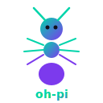

<div align="center">



# 🐜 oh-pi / Ant Colony for Pi

**Turn [pi-coding-agent](https://github.com/badlogic/pi-mono) from a single coding agent into a collaborative ant-colony execution system.**

This repository is being re-centered from a general pi setup bundle into a **colony-first plugin for complex coding tasks**.
`oh-pi` remains the current distribution/bootstrap entrypoint, while **`ant-colony` is the primary capability and long-term product direction**.

[](https://www.npmjs.com/package/oh-pi)
[](./LICENSE)
[](https://nodejs.org)

[English](./README.md) | [中文](./README.zh.md) | [Français](./README.fr.md)

```bash
npx oh-pi
```

</div>

---

## New Positioning

### This is no longer framed as a “configuration mega-pack”

We are intentionally moving away from defining the product as:
- a bundle of themes, presets, skills, and convenience setup
- an “oh-my-zsh for pi” style wrapper

We now define the core as:
- **Ant Colony for Pi**
- **a multi-agent plugin for complex coding tasks**
- **a way to give pi scouting, task decomposition, parallel execution, review, and recovery loops**

### What problem it solves

Single-agent execution starts to strain when a task:
- touches **3+ files**
- requires **cross-module understanding or refactoring**
- can be split into **parallel sub-tasks**
- needs **post-execution review and repair loops**

Ant Colony is not trying to replace pi. It is trying to give pi a stronger execution layer for tasks that exceed a single agent’s comfort zone.

## 30-Second Start

```bash
npx oh-pi    # current bootstrap entrypoint for Ant Colony for Pi
pi           # use colony capabilities inside pi
```

For now, `oh-pi` still installs and wires everything into `~/.pi/agent/`.
The product direction, however, is toward a **clearer standalone plugin identity**, not a bigger all-in-one configuration bundle.

## Release Status

**Ant Colony for Pi is now publishable as a Beta product.**

What that means:
- the colony plugin architecture is in place
- core and pi integration boundaries are now physically separated in code
- compatibility wrappers are retained for older import paths
- the main user flows are implemented and tested

What it does **not** mean yet:
- not a 1.0 / GA claim
- not benchmarked across every provider + environment combination
- not a promise that every user-facing command or internal import path is frozen forever

## See the colony value first

### If you say

```text
"Refactor auth from sessions to JWT, add tests, and run a regression pass."
```

### Ant Colony responds like this

```text
1. scouts inspect the codebase and identify boundaries
2. planners generate a task pool and execution order
3. workers modify separate files or modules in parallel
4. reviewers validate changes and request repairs if needed
5. results are summarized back into the main conversation
```

That is the real product edge here: **complex-task throughput, decomposition quality, and execution reliability**.

- [`docs/DEMO-SCRIPT.md`](./docs/DEMO-SCRIPT.md) — 2-minute walkthrough
- [`ROADMAP.md`](./ROADMAP.md) — milestones under the new positioning
- [`DECISIONS.md`](./DECISIONS.md) — product and architecture trade-offs
- [`docs/PRODUCT.md`](./docs/PRODUCT.md) — product boundary, fit, and non-goals
- [`docs/ARCHITECTURE-REFACTOR.md`](./docs/ARCHITECTURE-REFACTOR.md) — codebase refactor plan for plugin boundaries

## When to Use Ant Colony

Prefer colony for:

- multi-file changes
- cross-module refactors
- new feature decomposition
- test completion, fixes, and regression checks
- engineering work that benefits from parallel execution

## When Not to Use Ant Colony

Use plain pi workflows when:

- only 1 file needs a clear, contained change
- you need quick Q&A or explanation
- the task requires strict human step-by-step control
- the work is fundamentally non-parallel and highly context-concentrated

## What This Repo Currently Contains

```
~/.pi/agent/
├── auth.json            API keys (0600 permissions)
├── settings.json        Model, theme, thinking level
├── keybindings.json     Vim/Emacs shortcuts (optional)
├── AGENTS.md            Role-specific AI guidelines
├── extensions/          8 extensions (7 default + ant-colony)
│   ├── safe-guard       Dangerous command confirmation + path protection
│   ├── git-guard        Auto stash checkpoints + dirty repo warning
│   ├── auto-session     Session naming from first message
│   ├── custom-footer    Enhanced status bar (token/cost/time/git/cwd)
│   ├── compact-header   Streamlined startup info
│   ├── auto-update      Check for updates on launch
│   ├── bg-process       ⏳ **Bg Process** — Auto-background long-running commands (dev servers, etc.)
│   └── ant-colony/      🐜 Autonomous multi-agent swarm (optional)
├── prompts/             10 templates (/review /fix /commit /test ...)
├── skills/              10 skills (tools + UI design + workflows)
└── themes/              6 custom themes
```

## Setup Modes

| Mode | Steps | For |
|------|-------|-----|
| 🚀 **Quick** | 3 | Pick provider → enter key → done |
| 📦 **Preset** | 2 | Choose a role profile → enter key |
| 🎛️ **Custom** | 6 | Pick everything yourself |

### Presets

| | Theme | Thinking | Includes |
|---|-------|----------|----------|
| ⚫ Full Power | oh-pi Dark | high | All extensions + bg-process + ant-colony |
| 🔴 Clean | Default | off | No extensions, just core |
| 🐜 Colony Only | oh-pi Dark | medium | Ant-colony with minimal setup |

### Providers

Anthropic · OpenAI · Google Gemini · Groq · OpenRouter · xAI · Mistral · [FOXNIO](https://www.foxnio.com) (recommended public-benefit Claude provider)

Auto-detects API keys from environment variables.

## 🐜 Ant Colony

The headline feature. A multi-agent swarm modeled after real ant ecology — deeply integrated into pi's SDK.

```
You: "Refactor auth from sessions to JWT"

oh-pi:
  🔍 Scout ants explore codebase (haiku — fast, cheap)
  📋 Task pool generated from discoveries
  ⚒️  Worker ants execute in parallel (sonnet — capable)
  🛡️ Soldier ants review all changes (sonnet — thorough)
  ✅ Done — report auto-injected into conversation
```

### What's new in the current Beta line

- **Planning Recovery Loop**: if scouts return unstructured intel, colony enters `planning_recovery` instead of failing immediately.
- **Plan Validation Gate**: before workers start, tasks are validated (title/description/caste/priority).
- **Scout Quorum for complex goals**: multi-step goals default to at least 2 scouts for better planning reliability.
- **Thin-entry plugin architecture**: real implementations now live in `core/` and `pi/`, with compatibility wrappers preserved.
- **Background passive progress**: colony progress is pushed back into the session without forcing active polling.

### Colony lifecycle (simple)

`SCOUTING → (if needed) PLANNING_RECOVERY → WORKING → REVIEWING → DONE`

### Architecture

Each ant is an in-process `AgentSession` (pi SDK), not a child process:

```
pi (main process)
  └─ ant_colony tool
       └─ queen.ts → runColony()
            └─ spawnAnt() → createAgentSession()
                 ├─ session.subscribe() → real-time token stream
                 ├─ Zero startup overhead (shared process)
                 └─ Shared auth & model registry
```

**Interactive mode:** Colony runs in the background — you keep chatting. A live widget shows ant progress, and results are auto-injected when done.

**Print mode (`pi -p`):** Colony runs synchronously, blocks until complete.

### Why ants?

Real ant colonies solve complex problems without central control. Each ant follows simple rules, communicates through **pheromone trails**, and the colony self-organizes. oh-pi maps this directly:

| Real Ants | oh-pi |
|-----------|-------|
| Scout finds food | Scout scans codebase, identifies targets |
| Pheromone trail | `.ant-colony/pheromone.jsonl` — shared discoveries |
| Worker carries food | Worker executes task on assigned files |
| Soldier guards nest | Soldier reviews changes, requests fixes |
| More food → more ants | More tasks → higher concurrency (auto-adapted) |
| Pheromone evaporates | 10-minute half-life — stale info fades |

### Real-time UI

In interactive mode, the colony shows live progress:

- **Status bar** — compact footer with real metrics: tasks done, active ants, tool calls, output tokens, cost, elapsed time
- **Ctrl+Shift+A** — overlay detail panel with task list, active ant streams, and colony log
- **Notification** — completion summary when done

Use `/colony-stop` to abort a running colony.

### Signal Protocol

The colony communicates with the main conversation via structured signals, so the model never has to guess background state. Updates are passively pushed (non-blocking), so polling is optional:

| Signal | Meaning |
|--------|---------|
| `COLONY_SIGNAL:LAUNCHED` | Colony started in background |
| `COLONY_SIGNAL:SCOUTING` | Scout wave is exploring / planning |
| `COLONY_SIGNAL:PLANNING_RECOVERY` | Plan recovery loop is restructuring tasks |
| `COLONY_SIGNAL:WORKING` | Worker phase is executing tasks |
| `COLONY_SIGNAL:REVIEWING` | Soldier review phase is active |
| `COLONY_SIGNAL:TASK_DONE` | A task finished (progress checkpoint) |
| `COLONY_SIGNAL:COMPLETE` | Colony finished and report injected |
| `COLONY_SIGNAL:FAILED` | Colony failed with diagnostics |
| `COLONY_SIGNAL:BUDGET_EXCEEDED` | Budget limit reached |

### Turn Control

Each ant has a strict turn budget to prevent runaway execution:

Scout: 8 turns · Worker: 15 turns · Soldier: 8 turns

### Model Selection

The colony auto-detects available models and lets the LLM pick the best fit per role:

| Role | Strategy | Example |
|------|----------|---------|
| Scout | Fast & cheap — only reads, no edits | `claude-haiku-4-5`, `gpt-4o-mini` |
| Worker | Capable — makes code changes | `claude-sonnet-4-0`, `gpt-4o` |
| Soldier | Same as worker or slightly cheaper | `claude-sonnet-4-0` |

Omit model overrides to use the current session model for every ant.

## Beta Capability Matrix

| Capability | Status | Notes |
|-----------|--------|-------|
| Colony tool launch (`ant_colony`) | ✅ Beta-ready | Background in UI sessions, sync in print/no-UI mode |
| Scout → worker → soldier lifecycle | ✅ Beta-ready | Includes planning recovery and review phase |
| Passive progress signals | ✅ Beta-ready | `COLONY_SIGNAL:*` follow-up updates |
| Manual snapshot / stop / resume | ✅ Beta-ready | `bg_colony_status`, `/colony-stop`, `/colony-resume` |
| Detail overlay | ✅ Beta-ready | `Ctrl+Shift+A` |
| Adaptive concurrency | ✅ Beta-ready | CPU / memory / rate-limit aware |
| Checkpoint resume | ✅ Beta-ready | Resumable nest state in `.ant-colony/` |
| Import-path compatibility wrappers | ✅ Beta-ready | Root-level wrappers forward to real `core/` and `pi/` modules |
| Provider coverage across all environments | ⚠️ Partial | Core flow works, but broad cross-provider smoke coverage is still limited |
| Stable long-term plugin API guarantee | ⚠️ Not yet | Treat current surface as Beta |

### Cost Reporting

The colony tracks cost per ant and total spend, reported in the final summary. **Cost never interrupts execution** — turn limits and concurrency control handle resource management.

### Auto-trigger

The LLM decides when to deploy the colony. You don't have to think about it:

- **≥3 files** need changes → colony
- **Parallel workstreams** possible → colony
- **Single file** change → direct execution (no colony overhead)

### Adaptive Concurrency

The colony automatically finds the optimal parallelism for your machine:

```
Cold start     →  ceil(max/2) ants (fast ramp-up)
Exploration    →  +1 each wave, monitoring throughput
Throughput ↓   →  lock optimal, stabilize
CPU > 85%      →  reduce immediately
429 rate limit →  -1 concurrency + backoff (2s→5s→10s cap)
Tasks done     →  scale down to minimum
```

### File Safety

One ant per file. Always. Conflicting tasks are automatically blocked and resume when locks release.

## Skills

oh-pi ships 10 skills in three categories.

### 🔧 Tool Skills

Zero-dependency Node.js scripts — no API keys needed.

| Skill | What it does |
|-------|-------------|
| `context7` | Query latest library docs via Context7 API |
| `web-search` | DuckDuckGo search (free, no key) |
| `web-fetch` | Extract webpage content as plain text |

```bash
# Examples
./skills/context7/search.js "react"
./skills/web-search/search.js "typescript generics" -n 5
./skills/web-fetch/fetch.js https://example.com
```

### 🎨 UI Design System Skills

Complete design specs with CSS tokens, component examples, and design principles. The agent loads these when you ask for a specific visual style.

| Skill | Style | CSS Prefix |
|-------|-------|-----------|
| `liquid-glass` | Apple WWDC 2025 translucent glass | `--lg-` |
| `glassmorphism` | Frosted glass blur + transparency | `--glass-` |
| `claymorphism` | Soft 3D clay-like surfaces | `--clay-` |
| `neubrutalism` | Bold borders, offset shadows, high contrast | `--nb-` |

Each includes `references/tokens.css` with ready-to-use CSS custom properties.

```
You: "Build a dashboard with liquid glass style"
pi loads liquid-glass skill → applies --lg- tokens, glass effects, specular highlights
```

### 🔄 Workflow Skills

| Skill | What it does |
|-------|-------------|
| `quick-setup` | Detect project type, generate .pi/ config |
| `debug-helper` | Error analysis, log interpretation, profiling |
| `git-workflow` | Branching, commits, PRs, conflict resolution |
| `ant-colony` | Colony management commands and strategies |

## Themes

| | |
|---|---|
| 🌙 **oh-pi Dark** | Cyan + purple, high contrast |
| 🌙 **Cyberpunk** | Neon magenta + electric cyan |
| 🌙 **Nord** | Arctic blue palette |
| 🌙 **Catppuccin Mocha** | Pastel on dark |
| 🌙 **Tokyo Night** | Blue + purple twilight |
| 🌙 **Gruvbox Dark** | Warm retro tones |

## Prompt Templates

```
/review    Code review: bugs, security, performance
/fix       Fix errors with minimal changes
/explain   Explain code, simple to detailed
/refactor  Refactor preserving behavior
/test      Generate tests
/commit    Conventional Commit message
/pr        Pull request description
/security  OWASP security audit
/optimize  Performance optimization
/document  Generate documentation
```

## AGENTS.md Templates

| Template | Focus |
|----------|-------|
| General Developer | Universal coding guidelines |
| Full-Stack Developer | Frontend + backend + DB |
| Security Researcher | Pentesting & audit |
| Data & AI Engineer | MLOps & pipelines |
| 🐜 Colony Operator | Multi-agent orchestration |

## Install Paths

### Option 1: bootstrap install

```bash
npx oh-pi
```

Use this if you want the guided setup flow.

### Option 2: install as a Pi package

```bash
pi install npm:oh-pi
```

Use this if you already have Pi and want to add the packaged resources directly.

This currently adds themes, prompts, skills, and extensions, including `ant-colony`.

### Option 3: use the extension source directly

See [`pi-package/extensions/ant-colony/README.md`](./pi-package/extensions/ant-colony/README.md) for the extension-level layout and direct integration notes.

## Release Artifacts

- [Release checklist](./RELEASE-CHECKLIST.md)
- [Changelog](./CHANGELOG.md)
- [Release notes for v0.1.85](./RELEASE-NOTES-v0.1.85.md)

## Requirements

- Node.js ≥ 20
- At least one LLM API key
- pi-coding-agent (installed automatically if missing)

## License

MIT
